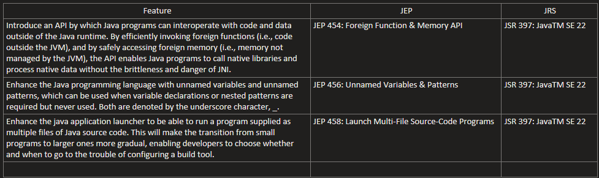
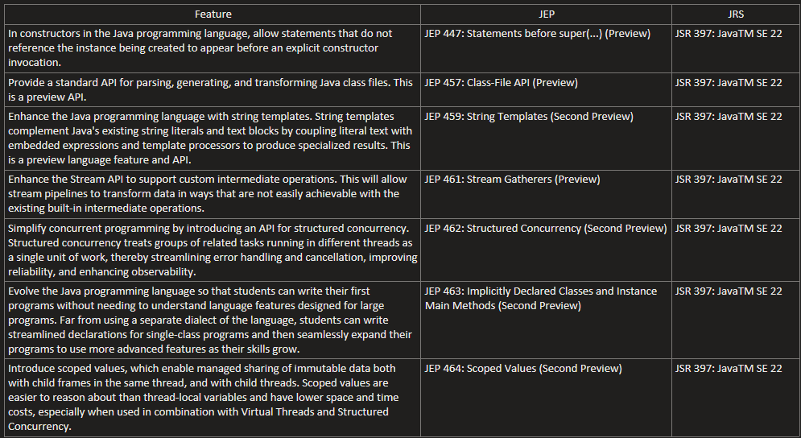
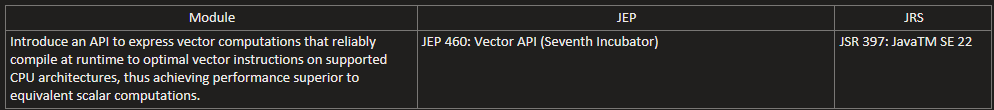

# java-22-features
## New Features:

## New Preview Features:

## New Incubator modules:

## Settings in IntelliJ IDEA to use "Preview" features with Java 22
#### Settings > Build, Execution, Deployment > Compiler > Java Compiler :
- #### Project bytecode version: 22
- #### Per-module bytecode version:
    - #### Module: java-22-features
    - #### Target bytecode version: 22
- #### Javac Options:
    - #### Additional command line parameters: --enable-preview
#### Run/Debug Configurations > Application > [Choose Application] :
- #### Build and Run > Modify Options > Add VM Options :
    - #### VM Options: --enable-preview
## Settings in IntelliJ IDEA to use "Incubator" modules with Java 22
#### Settings > Build, Execution, Deployment > Compiler > Java Compiler :
- #### Project bytecode version: 22
- #### Per-module bytecode version:
    - #### Module: java-22-features
    - #### Target bytecode version: 22
- #### Javac Options:
    - #### Additional command line parameters: --add-modules [Module Package]
      ```
      --add-modules jdk.incubator.vector
      ```
#### Run/Debug Configurations > Application > [Choose Application] :
- #### Build and Run > Modify Options > Add VM Options :
    - #### VM Options: --add-modules [Module Package]
      ```
      --add-modules jdk.incubator.vector
      ```
#### New > File > [New File Name] :

- #### Enter the name "module-info.java"
  - #### Open file "module-info.java"
  - #### Enter the following lines of code:
    ```java
    module org.duna {
      requires jdk.incubator.vector;
      exports org.duna.jep460;
    }
    ```