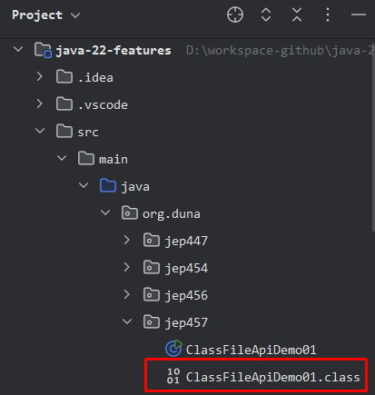

# JEP 457: Class-File API (Preview)
#### Provide a standard API for parsing, generating, and transforming Java class files. This is a preview API.
## Run Program
### Execute the following instructions from the terminal:
#### Compile program "ClassFileApiDemo01.java". A "ClassFileApiDemo01.class" file is generated.
```
javac --release 22 --enable-preview .\src\main\java\org\duna\jep457\ClassFileApiDemo01.java
```


#### Run compiled program "ClassFileApiDemo01.class", this in turn will create compiled program "HelloWorld.class".
```
java --enable-preview -cp .\src\main\java org.duna.jep457.ClassFileApiDemo01
```


#### Run compiled program "HelloWorld.class"
```
java --enable-preview -cp .\src\main\java org.duna.jep457.HelloWorld
```
