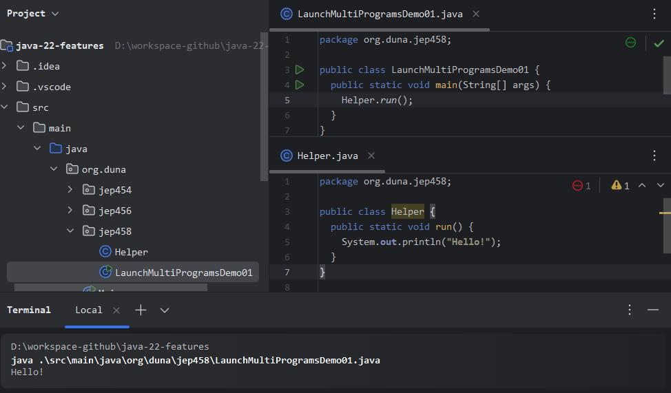

# JEP 458: Launch Multi-File Source-Code Programs
#### Enhance the java application launcher to be able to run a program supplied as multiple files of Java source code. This will make the transition from small programs to larger ones more gradual, enabling developers to choose whether and when to go to the trouble of configuring a build tool.
## Run Program
### Execute the following instruction from the terminal:
```
java .\src\main\java\org\duna\jep458\LaunchMultiProgramsDemo01.java
```
